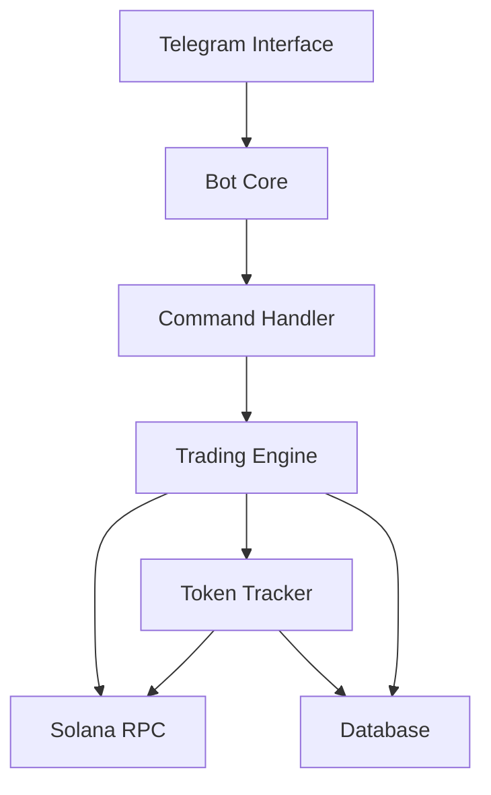
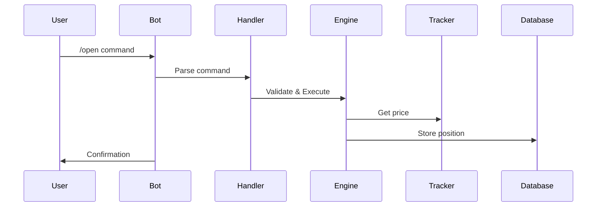

# KiTraderBot Technical Overview
=================================

## Table of Contents
1. System Overview
2. Architecture
3. Core Components
4. Database Architecture
5. Command System
6. Trading Engine
7. Solana Integration
8. Testing & Quality Assurance
9. Deployment
10. Monitoring & Maintenance

## 1. System Overview

### Purpose
KiTraderBot is a Telegram-based trading bot that enables simulated Solana token trading. It provides:
- Virtual wallet management
- Position tracking
- Price monitoring
- Risk management
- User role-based access

### Tech Stack
- Python 3.12
- PostgreSQL 16.4
- Telegram Bot API
- Solana Web3
- asyncio/asyncpg

## 2. Architecture

### High-Level Architecture


### Component Relationships
- Bot Core orchestrates all components
- Trading Engine manages positions and executions
- Token Tracker monitors prices and updates
- Database stores all persistent data
- RPC Manager handles Solana network communication

## 3. Core Components

### Bot Core (`/opt/KiTraderBot/bot.py`)
- Initializes all components
- Manages command routing
- Handles user sessions
- Implements error handling

### Trading Engine (`/scripts/solana/trading_engine.py`)
```python
class TradingEngine:
    """Manages simulated trading operations"""
    def __init__(self, db_pool, token_tracker, user_manager):
        self.db = db_pool
        self.tracker = token_tracker
        self.user_manager = user_manager
        self.position_limits = {
            'basic': 100,
            'premium': 1000,
            'admin': float('inf')
        }
```

### Token Tracker (`/scripts/solana/token_tracker.py`)
- Monitors token prices
- Updates price database
- Calculates metrics
- Manages token metadata

### RPC Manager (`/scripts/solana/rpc_manager.py`)
- Handles Solana RPC connections
- Implements failover
- Rate limiting
- Connection pooling

## 4. Database Architecture

### Schema Overview
```sql
-- Core Tables
users
virtual_wallets
positions
solana_tokens
token_prices
token_metrics
```

### Key Relationships
```sql
positions
    → users (user_id)
    → solana_tokens (token_address)

virtual_wallets
    → users (user_id)

token_prices
    → solana_tokens (token_address)
```

### Critical Indexes
```sql
-- Performance-critical indexes
"idx_open_positions" btree (user_id) WHERE status = 'open'
"idx_token_address_status" btree (token_address) WHERE is_active = true
"users_telegram_id_key" UNIQUE btree (telegram_id)
```

## 5. Command System

### Command Handler (`/scripts/solana/bot_commands.py`)
Implements all Telegram commands:

#### Trading Commands
```python
/start  - Initialize user
/help   - Show commands
/wallet - Show balance
/open   - Open position
/close  - Close position
/price  - Get token price
/info   - Token information
```

#### Command Flow Example


## 6. Trading Engine

### Position Management
```python
async def open_position(self, user_id, token_address, size_sol, position_type):
    """Execute a simulated trade"""
    try:
        # Verify token is tracked
        if not await self.tracker.track_new_token(token_address):
            return None
            
        # Get current price
        price = await self.get_current_price(token_address)
        
        # Create position record
        position_id = await self.create_position_record(
            user_id, token_address, price, size_sol, position_type
        )
        
        return {
            'position_id': position_id,
            'entry_price': price,
            'size': size_sol,
            'type': position_type
        }
    except Exception as e:
        logger.error(f"Error opening position: {e}")
        return None
```

### Risk Management
- Position size limits by user role
- Price monitoring
- Balance verification
- Transaction atomicity

## 7. Solana Integration

### RPC Configuration
```python
endpoints = {
    'primary': 'https://api.mainnet-beta.solana.com',
    'backup': [
        'https://solana-api.projectserum.com',
        'https://rpc.ankr.com/solana'
    ]
}
```

### Token Tracking
- Price updates every 60 seconds
- Automatic failover
- Rate limiting
- Error recovery

## 8. Testing & Quality Assurance

### Test Structure
```
/scripts/solana/tests/
    test_bot_commands.py
    test_integration.py
    test_trading_engine.py
    test_token_tracker.py
    test_solana.py
```

### Testing Strategy
1. Unit Tests
   - Component isolation
   - Mock external services
   - Database fixtures

2. Integration Tests
   - End-to-end flows
   - RPC interaction
   - Database consistency

3. Load Testing
   - Concurrent users
   - Price update frequency
   - Database performance

## 9. Deployment

### Requirements
- Ubuntu Server
- PostgreSQL 16.4
- Python 3.12
- Virtual Environment
- Systemd Service

### Service Configuration
```ini
[Unit]
Description=KiTraderBot Telegram Trading Bot
After=network.target postgresql.service

[Service]
Type=simple
User=root
WorkingDirectory=/opt/KiTraderBot
Environment=PYTHONPATH=/opt/KiTraderBot
ExecStart=/opt/KiTraderBot/venv/bin/python3 bot.py
Restart=always

[Install]
WantedBy=multi-user.target
```

## 10. Monitoring & Maintenance

### Health Checks
- RPC connection status
- Database connectivity
- Price update frequency
- Position monitoring

### Logging
```python
logging.basicConfig(
    format='%(asctime)s - %(name)s - %(levelname)s - %(message)s',
    level=logging.INFO,
    handlers=[
        logging.FileHandler('/var/log/kitraderbot/bot.log'),
        logging.FileHandler('/var/log/kitraderbot/error.log'),
        logging.StreamHandler(sys.stdout)
    ]
)
```

### Backup Strategy
- Daily database backups
- Transaction logs
- Configuration backups
- User data protection

## Security Considerations

### Data Protection
- Encrypted credentials
- Secure RPC connections
- Role-based access
- Input validation

### Error Handling
```python
try:
    # Operation
    await self.execute_operation()
except SolanaRpcException as e:
    logger.error(f"RPC error: {e}")
    await self.handle_rpc_error(e)
except DatabaseError as e:
    logger.error(f"Database error: {e}")
    await self.handle_db_error(e)
except Exception as e:
    logger.error(f"Unexpected error: {e}")
    await self.handle_general_error(e)
```

## Future Improvements

1. Performance Optimizations
   - Connection pooling
   - Query optimization
   - Caching layer

2. Feature Additions
   - Advanced order types
   - Technical analysis
   - Portfolio analytics

3. Infrastructure
   - Load balancing
   - Redundancy
   - Automated scaling

## Documentation & Support

### API Documentation
- Command reference
- Database schema
- Component interfaces
- Error codes

### Troubleshooting
1. Common Issues
2. Resolution Steps
3. Support Contacts
4. Emergency Procedures

---

Last Updated: November 28, 2024
Version: 1.0.0
